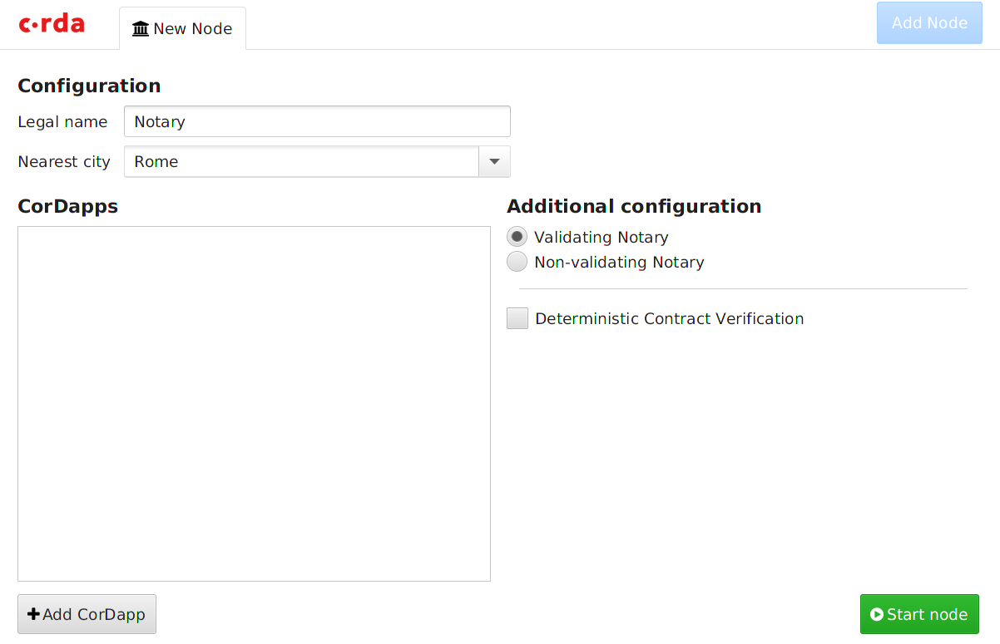
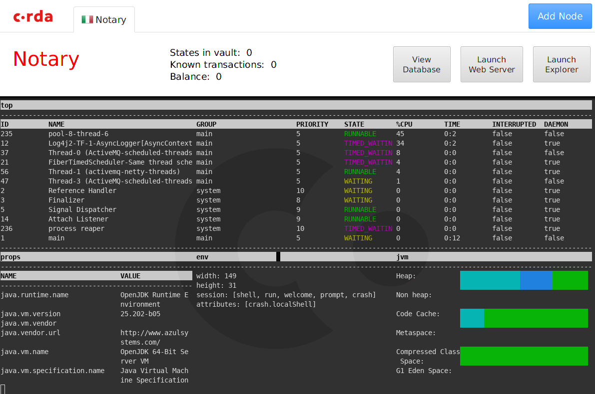
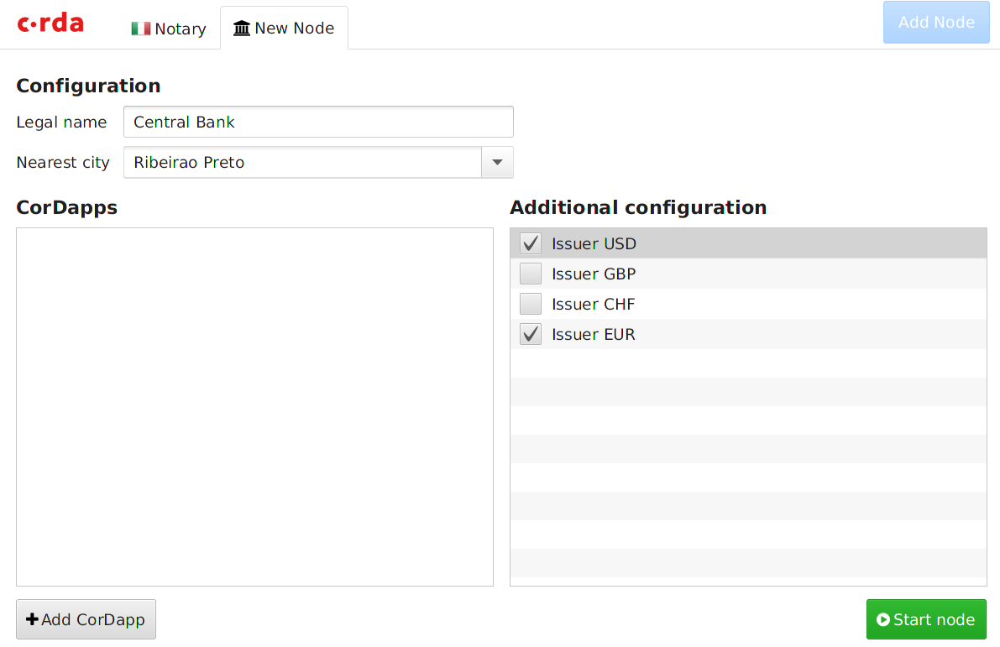
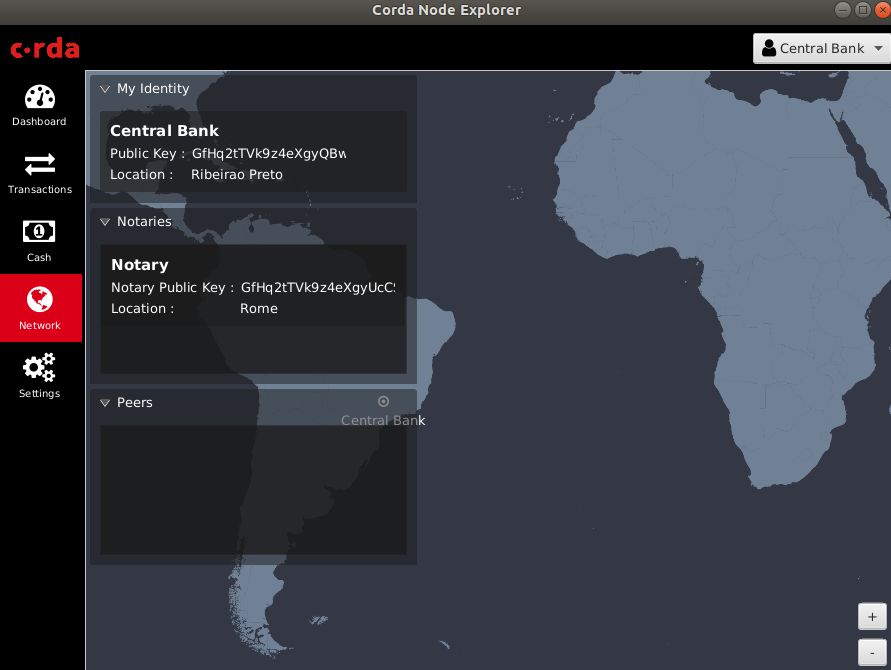
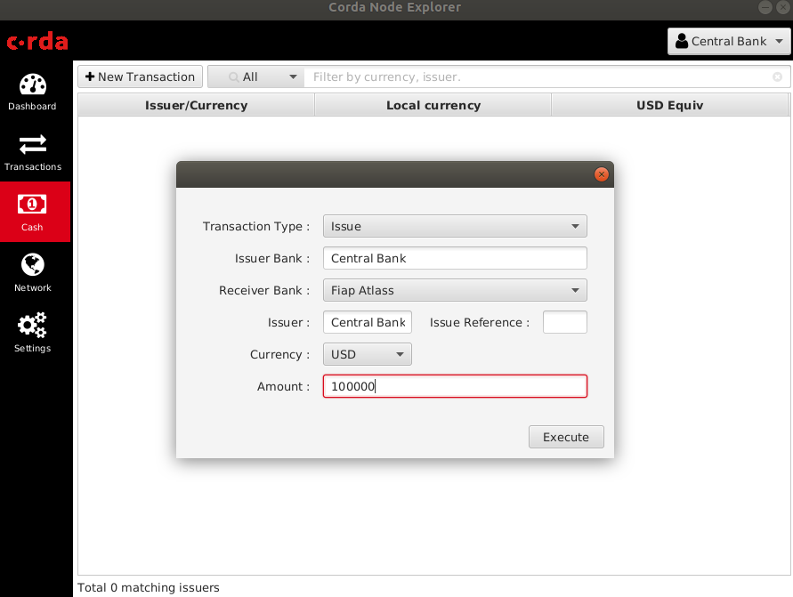
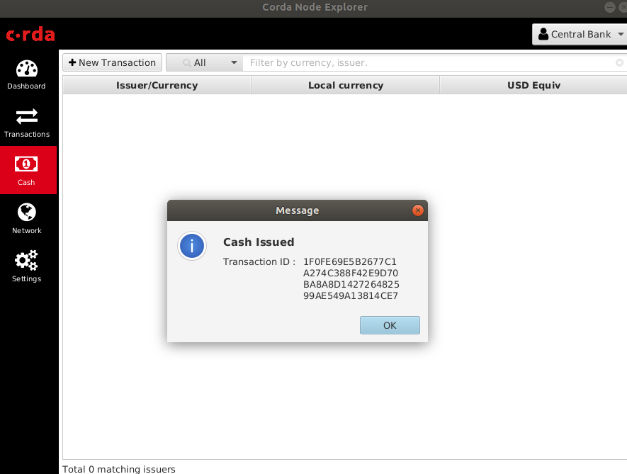
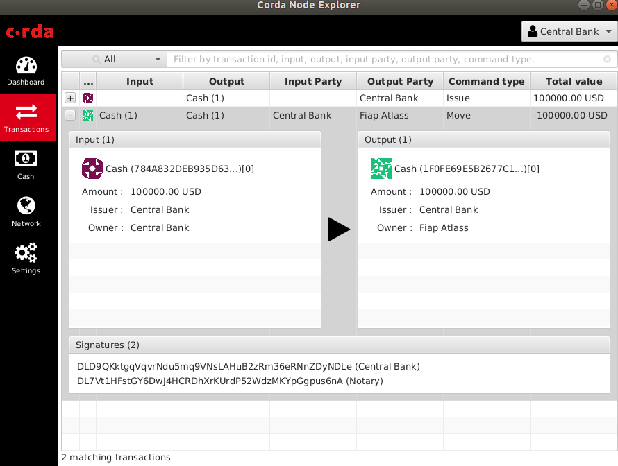

# c.rda (corda foundation)

```bash
 __________________________
< Tô com a Corda toda! LOL >
 --------------------------
        \   ^__^
         \  (oo)\_______
            (__)\       )\/\
                ||----w |
                ||     ||
```

Corda é um projeto DLT da empresa R3 e nasceu de um consórcio privado entre +70 (2015) bancos, mais tarde na v1.0 (2017) o projeto se torna open source.

# Corda Open vs Enterprise 

|Open|Enterprise|
|---|---|
|Sem suporte uso da comunidade|Suporte 24x7 equipe R3|
|garante até 25 TPS|garantem de 600 à 1K TPS|
|não garante interoperabilidade nativa com outra databases|garante interoperabilidade nativa com outra databases|
||fee por transação|

# Plataforma Corda

1. Rede Permissionada 
2. Privacidade e transações confidênciais
3. Não e criptomoeda
4. SmartContract

# Na Virtual Machine...

Abra um terminal novo:

```bash
# volte para seu home

# acesse o diretorio corda
cd ~/corda/tools/demobench/build/install/demobench/

# abrir o frontend
bin/demobench
```




```bash

   ______               __
  / ____/     _________/ /___ _
 / /     __  / ___/ __  / __ `/         I named my dog 'Six Miles' so I can tell
/ /___  /_/ / /  / /_/ / /_/ /          people I walk Six Miles every day.
\____/     /_/   \__,_/\__,_/

--- Corda Open Source 4.4-SNAPSHOT (76e0054) -------------------------------------------------------------


Logs can be found in                    : /home/aluno/demobench/20191205211638/notary/logs
! ATTENTION: This node is running in development mode!  This is not safe for production deployment.
Database connection url is              : jdbc:h2:tcp://localhost:10004/node
Advertised P2P messaging addresses      : localhost:10000
RPC connection address                  : localhost:10001
RPC admin connection address            : localhost:10002
Loaded 2 CorDapp(s)                     : Contract CorDapp: Corda Finance Demo version 1 by vendor R3 with licence Open Source (Apache 2), Workflow CorDapp: Corda Finance Demo version 1 by vendor R3 with licence Open Source (Apache 2)
Node for "Notary" started up and registered in 40.15 sec


Welcome to the Corda interactive shell.
Useful commands include 'help' to see what is available, and 'bye' to shut down the node.

Thu Dec 05 21:21:20 BRST 2019>>> dashboard

```

Após digitar `dashboard` deve aparecer:



Clique no Botão Azul `Add Node` e adcionei como no Exemplo:



Digite `dashboard` novamente e depois clique no botão `Lauch Explorer`



Suba mais um node e veja que o consumo de recursos (principalmente memória) começa a subir.


Mandando dinheiro do `Central Bank` para outros bancos (Casa de Papel)








### Na VM

```bash
#voltar para o home
cd 

# entrar na pasta corda
cd corda

# clonar o repositorio 
git clone https://github.com/corda/samples.git

# entrar no diretorio samples
cd samples

# listar arquivos
ls 
build.gradle  gradle             gradlew.bat  README.md            test.zip
config        gradle.properties  graph.png    repositories.gradle  TRADEMARK
contracts     gradlew            LICENCE      settings.gradle      workflows


# deploy and run the nodes by?
./gradlew deployNodes
Starting a Gradle Daemon, 1 busy and 3 incompatible Daemons could not be reused, use --status for details

> Task :deployNodes
Running Cordform task
Deleting /home/aluno/corda/samples/sendfile-Attachments/build/nodes
Bootstrapping local test network in /home/aluno/corda/samples/sendfile-Attachments/build/nodes
Generating node directory for Buyer
Generating node directory for Notary
Generating node directory for Seller
Waiting for all nodes to generate their node-info files...
<============-> 95% EXECUTING [2m 3s]
Distributing all node-info files to all nodes
Loading existing network parameters... none found
Gathering notary identities
Generating contract implementations whitelist
New NetworkParameters {
      minimumPlatformVersion=5
      notaries=[NotaryInfo(identity=O=Notary, L=London, C=GB, validating=false)]
      maxMessageSize=10485760
      maxTransactionSize=524288000
      whitelistedContractImplementations {
        
      }
      eventHorizon=PT720H
      packageOwnership {
        
      }
      modifiedTime=2020-02-08T13:18:25.344Z
      epoch=1
  }
Bootstrapping complete!

Deprecated Gradle features were used in this build, making it incompatible with Gradle 6.0.
Use '--warning-mode all' to show the individual deprecation warnings.
See https://docs.gradle.org/5.4.1/userguide/command_line_interface.html#sec:command_line_warnings

BUILD SUCCESSFUL in 2m 29s
14 actionable tasks: 14 executed

```

## Subir um node (um por vez)

```bash
# entrar no diretorio do build/nodes
cd build/nodes

# subir o Seller
cd Seller
java -jar corda.jar 

   ______               __
  / ____/     _________/ /___ _
 / /     __  / ___/ __  / __ `/         Computer science and finance together.
/ /___  /_/ / /  / /_/ / /_/ /          You should see our crazy Christmas parties!
\____/     /_/   \__,_/\__,_/

--- Corda Open Source 4.3 (d679784) -------------------------------------------------------------


Logs can be found in                    : /home/aluno/corda/samples/sendfile-Attachments/build/nodes/Seller/logs
! ATTENTION: This node is running in development mode!  This is not safe for production deployment.
Advertised P2P messaging addresses      : localhost:10008
RPC connection address                  : localhost:10009
RPC admin connection address            : localhost:10049
Loaded 2 CorDapp(s)                     : Workflow CorDapp: sendfile Flows version 1 by vendor Corda Open Source with licence Apache License, Version 2.0, Contract CorDapp: sendfile Contract version 1 by vendor Corda Open Source with licence Apache License, Version 2.0
Node for "Seller" started up and registered in 26.32 sec


Welcome to the Corda interactive shell.
Useful commands include 'help' to see what is available, and 'bye' to shut down the node.

Sat Feb 08 11:22:42 BRST 2020>>>

# Buyer
cd ../Buyer
java -jar corda.jar 


# Nodary
cd ../Nodary
java -jar corda.jar 

```

## Executar o flow no terminal Seller 

```bash

Sat Feb 08 11:23:01 BRST 2020>>> flow start SendAttachment receiver: Buyer
Working Directory = /home/aluno/corda/samples/sendfile-Attachments/build/nodes/Seller

 ✓ Starting
      Generating transaction
 ✓ PROCESS transaction
 ✓ Obtaining notary signature and recording transaction.
          Requesting signature by notary service
              Requesting signature by Notary service
              Validating response from Notary service
     ✓ Broadcasting transaction to participants
▶︎ Done
Flow completed with result: SignedTransaction(id=9FAD80FD680FA50D566043BABF54A07B8383D9666DD1D77BD28FF7D5528F7986)

```
